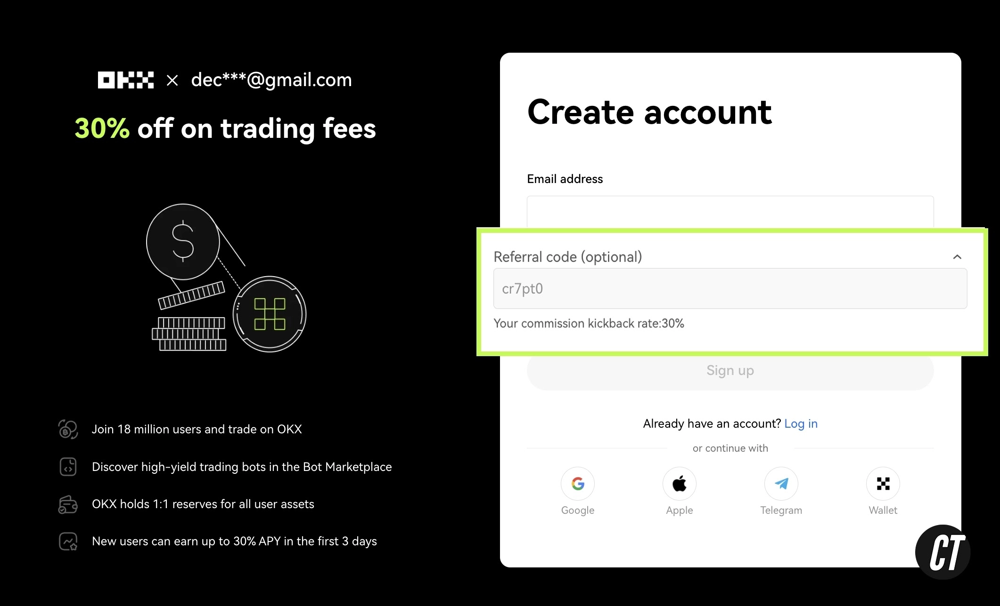
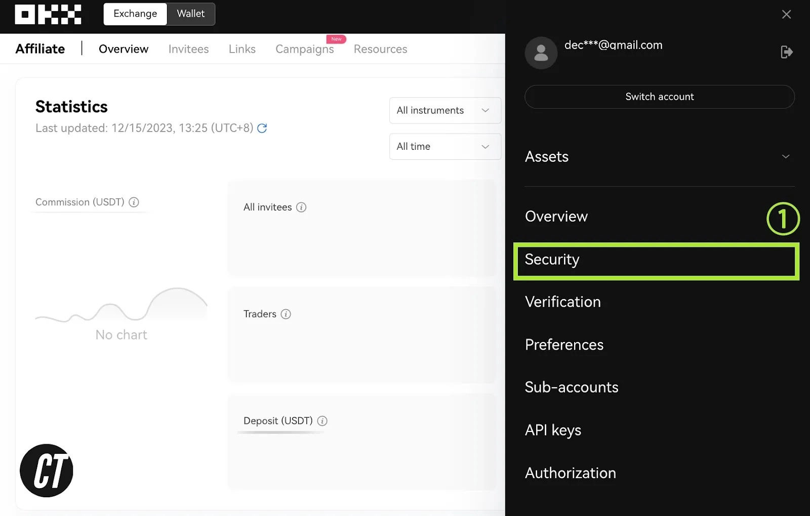
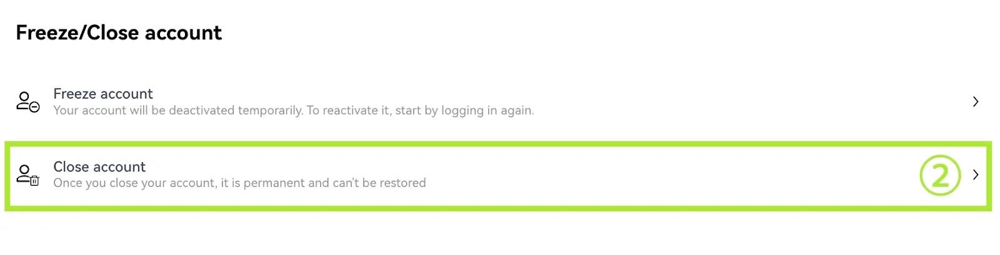

# How to Apply and Change OKX Referral Code (30% Fee Discount)

Planning to sign up for OKX exchange? If you're looking to save money on trading fees while getting started with crypto trading, there's a simple trick most new users miss. By using the right referral code during registration, you can slash your fees by up to 30% - that's real money staying in your pocket with every trade.

---

So you're ready to dive into OKX, but here's the thing - not all referral codes are created equal. Some give you nothing, others barely make a dent, and then there's the golden ticket: a full 30% discount on trading fees. Let me walk you through exactly how to grab that maximum discount, and what to do if you've already signed up without it.

## What's This Referral Code Thing Anyway?

Think of a referral code as your VIP pass to better rates. When you're creating your OKX account for the first time, there's a little box asking for a referral code. Drop in **47044926** there, and boom - you're in the 30% discount club. 

Here's what you need to look for: once you enter the code, you should see a message saying **"Your commission kickback rate: 30%"** right there on the signup screen. If you see that, you're golden. If not? Well, you're leaving money on the table with every trade.

Different codes offer different discounts - anywhere from 0% to that sweet 30%. Obviously, you want the maximum, right?

## Already Signed Up Without a Code? Here's Your Fix

Okay, so maybe you rushed through registration and skipped the referral code part. Or worse, you used some random code that barely gives you anything. Don't worry - there's a workaround, though it takes a bit of effort.

### Step 1: Move Your Assets Out

First things first, you need to transfer all your crypto out of your current OKX account. Send it to another exchange, a hardware wallet, wherever you keep your other coins. Just make sure that account is completely empty before moving to step two.

### Step 2: Delete Your Existing Account

Log into your OKX account and head over to Security settings. Look for the **"Close Account"** button and click it. The deletion usually processes within 24 hours, so you won't have to wait long.

### Step 3: Fresh Start with the Right Code

Once your old account is gone, 👉 [register with the maximum 30% discount code here](https://www.okx.com/join/47044926). This time, double-check that "30% kickback" message appears before you finish the signup process. Then just complete the regular verification steps, and you're all set with the proper discount locked in.

## Why Bother with All This?

Look, trading fees add up fast. If you're actively trading, that 30% discount means real savings every single month. Whether you're buying Bitcoin, trading altcoins, or just moving funds around, those reduced fees compound over time. It's like getting a permanent discount on everything you do on the platform.

The process to apply or change your referral code isn't complicated - it just requires a bit of attention during signup. Make sure you see that 30% confirmation, and you'll be saving money from your very first trade.

---

Getting the maximum fee discount on OKX really comes down to one thing: using the right code at the right time. Whether you're signing up fresh or fixing an old account, 👉 [the 47044926 code gets you that full 30% off trading fees](https://www.okx.com/join/47044926). It's a small step during registration that keeps paying you back with every trade you make.
